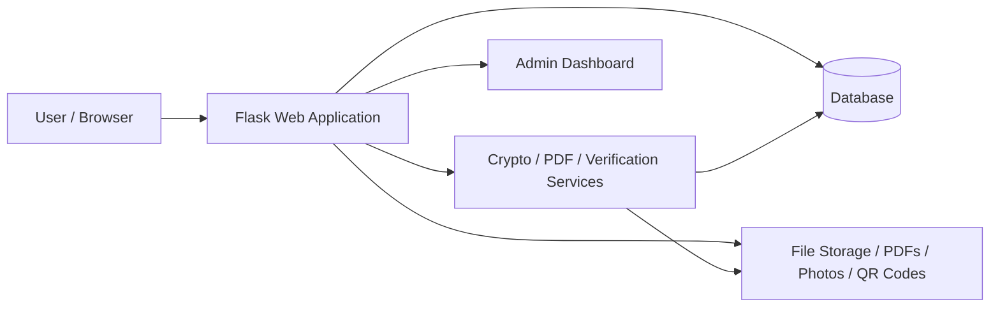

# ValidRent

A secure and modern rental management platform for landlords and tenants. ValidRent focuses on digital rental agreements, asset management, document verification, QR-based validation, and encrypted communication to make rental transactions more transparent, verifiable, and trustworthy.

This project was developed as a final-year academic initiative with a strong emphasis on cryptography, secure document handling, and practical web application design.

## Project Summary

ValidRent provides a complete workflow for managing rental activities in a single platform:

- Create and manage rental assets such as houses, apartments, rooms, vehicles, land, and offices
- Generate and manage rental agreements between landlords and tenants
- Support multi-role access for both landlords and tenants
- Upload and review identity documents and consent-based photos
- Generate PDF agreements and QR codes for verification
- Enable secure, encrypted chat communication between parties
- Provide verification workflows for mutual agreement validation

## Key Features

- Multi-role authentication and role switching
- Bilingual interface support
- Asset browsing and request management
- Agreement creation and lifecycle tracking
- PDF certificate and agreement generation
- QR code verification for agreements and documents
- Photo consent and identity document verification
- Secure chat and cryptography-based communication features
- Admin dashboard for monitoring and managing records

## Technology Stack

- Backend: Flask, Flask-SQLAlchemy, Flask-Login, Flask-WTF
- Database: SQLite for local development, PostgreSQL for production
- Security: cryptography, PyOpenSSL, QR code generation, PDF generation
- Frontend: Jinja2 templates, Bootstrap-style UI, vanilla JavaScript
- Deployment: Gunicorn, Docker, Render

## Architecture Diagram




## Project Structure

- app/ — main Flask application package
- app/routes/ — route handlers for authentication, assets, agreements, requests, chat, and verification
- app/models/ — database models for users, assets, agreements, requests, and documents
- app/services/ — cryptography, PDF, chat, and verification logic
- app/templates/ — HTML templates for the web UI
- tests/ — test suite for core application functionality
- storage/ — generated files and uploaded media

## Demo Video

A demo video for the project can be added here:

- Demo Video: https://www.youtube.com/watch?v=_y_K4GOjG64 

## How to Use

### 1. Clone the repository

```bash
git clone <repository-url>
cd Validrent
```

### 2. Create a Python virtual environment

On Windows PowerShell:

```powershell
python -m venv .venv
.\.venv\Scripts\Activate.ps1
```

### 3. Install dependencies

```bash
pip install -r requirements.txt
```

### 4. Configure environment variables

Create a .env file in the project root with values such as:

```env
SECRET_KEY=your-secret-key
DATABASE_URL=sqlite:///instance/validrent.db
BASE_URL=http://localhost:5000
FLASK_ENV=development
```

### 5. Run the application

```bash
python run.py
```

Then open:

```text
http://localhost:5000
```

## Docker Deployment

You can also run the project using Docker Compose:

```bash
docker compose up --build
```

This will start the web application and a PostgreSQL database container.

## Production Deployment

The project includes a Render deployment configuration in render.yaml.

### Render deployment steps

1. Push the repository to GitHub
2. Create a new Web Service in Render
3. Connect the repository
4. Render will use the provided configuration automatically
5. Set environment variables if needed

### Example production command

```bash
gunicorn --bind 0.0.0.0:$PORT --workers 2 run:app
```

## Environment Variables
defult password yse your own 
| Variable | Description |
| --- | --- |
| SECRET_KEY | Secret key for Flask session security |
| DATABASE_URL | Database connection string |
| BASE_URL | Public base URL of the application |
| FLASK_ENV | Application environment mode |

## Testing

Run the test suite with:

```bash
pytest
```

## Contribution

Contributions are welcome. If you want to improve the platform, add new features, or fix issues, please open a pull request or contact the project maintainer.

## License

This project is currently licensed. If you plan to distribute or publish it publicly, make sure you have a permission and appropriate open-source license.

## Contact

For questions or collaboration, please reach out to Susan Dhamala.
